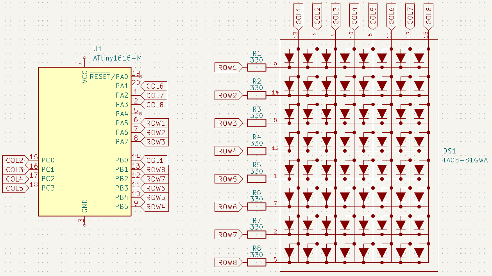

# Software PWM LED Matrix

Tiny demo that drives an 8×8 LED matrix using software PWM on an ATtiny1616 (Arduino via PlatformIO). Columns are scanned, rows are modulated to set brightness.

## Quick start
- Requirements: PlatformIO, ATtiny1616 board, UPDI programmer.
- Wire your matrix. Then edit the `row[]` and `col[]` pin arrays in `src/main.cpp` to match your wiring.
- Build: `platformio run`
- Upload: `platformio run -t upload`
- Run the demo: it shows a two‑digit counter and a moving footer pixel while brightness smoothly varies.

## Hardware
- MCU: ATtiny1616 @ 16 MHz
- Matrix: 8×8 LED matrix
- Programmer: UPDI (upload via jtag2updi)

### Driver API (SoftPWM_LedMatrix)
- `SoftPWM_LedMatrix(const uint8_t row[8], const uint8_t col[8])`
- `void setup()` - configures pins
- `void update(const byte pixels[8])` - advance timing, select current column, and drive rows; call in `loop()`
- `float setDuty(float duty)` - clamp and set duty [0.0, 1.0], returns the stored value
- `float duty() const` - current duty
- `void setPeriodMicros(uint16_t period)` - set PWM period (default: 2000 µs [=500Hz])

## Demo behavior
- Counts from 00 to 99 using a 3×5 font placed into the center columns.
- Animates a single footer bit that shifts each tick.
- Smoothly oscillates brightness between about 10% and 100%.

## Schematic

## License
MIT‑style hobby/educational use. Use at your own risk.
