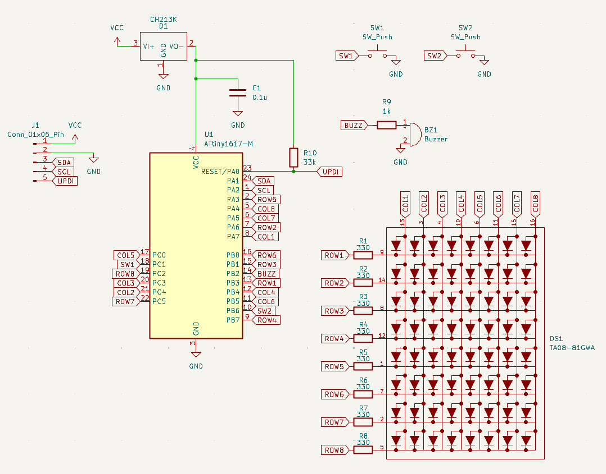

# Pomodoro Timer Specifications

This project is an Arduino (AVR) based Pomodoro timer with an 8x8 LED matrix display.

## Phase Settings

The timer has two phases:

- **WORK**: 25 minutes
- **BREAK**: 5 minutes

## Timer States

The timer has four states:

- **STOPPED**: The timer is not running.
- **RUNNING**: Countdown is in progress.
- **PAUSED**: Countdown is temporarily halted.
- **COMPLETED**: Countdown has finished.

## Controls (BTN1_PIN)

A single button supports the following operations:

- **Single Click**:
    - When `STOPPED`: `START` the timer.
    - When `RUNNING`: `PAUSE` the timer.
    - When `PAUSED`: `RESUME` the timer.
    - When `COMPLETED`: `STOP` the timer.
- **Double Click**:
    - Switch phase (WORK ↔ BREAK).
- **Long Press Start**:
    - Set LED matrix brightness to 0 (preparing for power down).
- **Long Press End**:
    - Enter power-down (sleep) mode. Wakes up on PC1 pin interrupt.

## Display and Feedback

### LED Matrix
- **Middle (Rows 2-6)**: Displays remaining time.
    - Displays "minutes" if 99 seconds or more.
    - Displays "seconds" if less than 99 seconds.
- **Top (Rows 0-1)**: Progress indicator based on seconds.
- **Bottom (Row 7)**: Status indicator.
    - `RUNNING`: Shows animation.
    - `PAUSED`: Blinks.
    - `COMPLETED`: All LEDs on and the entire screen flashes.

### Buzzer
- A short click sound plays for every second elapsed.
- An intermittent alarm sounds when the timer is `COMPLETED`.

## Schematic
